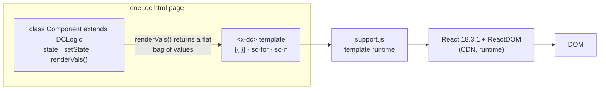
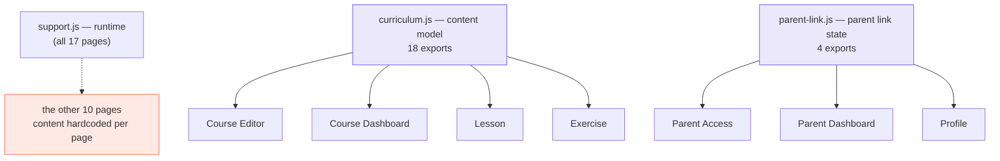
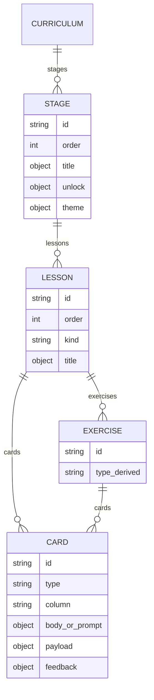
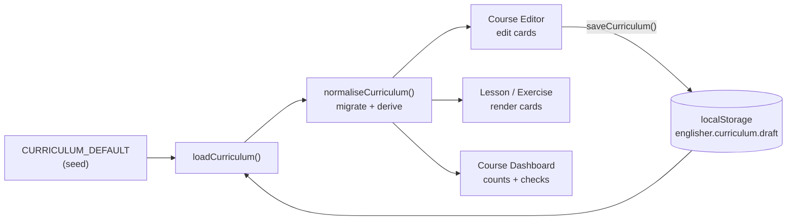

# Englisher — code architecture

A description of how the prototype is actually built, as of the current working tree.
Written from the source, not from the design docs, so it records what the code does
rather than what it was meant to do.

---

## 1. What the system is

Englisher is a bilingual (English / Sinhala) English-learning web app for Sinhala
speakers, with three audiences:

| Audience | Screens |
|---|---|
| **Learner** | Homepage, Sign Up, Sign In, Placement Test, Course Roadmap, Course Map, Stage Lessons, Lesson, Exercise, Guided Essay, Solo Essay, Formal Letter, Progress, Profile |
| **Parent** | Parent Access, Parent Dashboard |
| **Admin** | Course Dashboard, Course Editor |

It currently exists as a **client-only prototype**: 17 standalone HTML pages, no build
step, no server, no authentication. Persistence is `localStorage`. There is no backend,
but the code marks where one belongs (see §6).

**Size:** 4,811 lines across the 17 page files, plus 2,340 lines of shared JavaScript.

---

## 2. Runtime architecture

Every page is a self-contained HTML document with the same four-part shape:

```
<head>       loads shared modules, then the runtime
<x-dc>       <helmet> for page CSS, then the markup template
<script      class Component extends DCLogic { state; renderVals() }
 type="text/x-dc">
```

`support.js` (1,912 lines, **generated** — the header says
`GENERATED from dc-runtime/src/*.ts`) is a template runtime. It:

1. pulls **React 18.3.1** and **ReactDOM** from `unpkg.com` at page load,
2. parses the `<x-dc>` markup — a string template language with `{{ expr }}`
   interpolation, `<sc-for list as>` loops and `<sc-if value>` conditionals,
3. compiles it to React elements and mounts with `createRoot`,
4. exposes `DCLogic`, a React class component the page subclasses.



**The pages are already React underneath.** `renderVals()` is the render method;
`state` / `setState` are React's. What is bespoke is the template language and the fact
that a page's entire view is driven by one flat object of primitives and callbacks.

**Implication:** React is fetched from a CDN at runtime, so pages require internet
access and are not offline-capable or self-hosted.

---

## 3. Module structure

Three shared modules sit under the pages. There is no bundler and no `import` —
modules communicate through `window`.



### `curriculum.js` — the content model (376 lines)

The most important file in the project. It owns:

- `CURRICULUM_DEFAULT` — the seed content tree
- `TYPE_META` — the exercise-type registry, the single place a type is declared
- **Card helpers** — `makeCard`, `ensureCards`, `syncLessonFromCards`,
  `syncExerciseFromCards`, `normaliseCurriculum`, `cardGridColumn`
- **Markup helpers** — `parseRich`, `inlineRuns`, `plainText` for the lightweight
  `**bold** *italic* [link]()  - bullet` syntax
- **Persistence** — `loadCurriculum`, `saveCurriculum`
- `repairUnlocks` — keeps stage unlock rules consistent after reordering

It is plain ES5-style JavaScript with no dependency on the runtime, so it is the one
part of the codebase that ports to any framework unchanged.

### `parent-link.js` — parent link state (52 lines)

A small, well-shaped module: one state object (`status`, `contact`, `channel`,
timestamps), load/save, and `parentContactChannel` for validating an email or phone.
Shared correctly by all three pages that need it.

---

## 4. Content model

A lesson and an exercise are both **an ordered list of cards**, each card holding one
thing and declaring which column it occupies.



- `type` is `text` or one of the five exercise types in `TYPE_META`
  (`mcq`, `gap_fill`, `drag_order`, `match`, `free_text`).
- `column` is `left`, `right` or `full`; `full` spans both and breaks the run so the
  columns stay level. Rendering uses CSS grid auto-placement rather than pre-splitting
  the list into rows.
- Ids are **stable slugs, never array indices**, so reordering never invalidates a
  learner's progress rows.

### Backward compatibility

`cards` is the source of truth. The pre-cards fields — `lesson.explanation` and an
exercise's own `type` / `prompt` / `payload` / `feedback` — are **re-derived** on every
edit by `syncLessonFromCards`. Older content is migrated on load by `ensureCards`,
which is idempotent. This is why the Course Dashboard still works without knowing cards
exist.

---

## 5. State and persistence

Two independent slices, two `localStorage` keys:

| Key | Owner | Written by | Read by |
|---|---|---|---|
| `englisher.curriculum.draft` | `curriculum.js` | Course Editor (Save draft) | Editor, Dashboard, Lesson, Exercise |
| `englisher.parent.link` | `parent-link.js` | Parent Access | Parent Access, Parent Dashboard, Profile |



Within a page, state is a single React component's `state`. Editing follows a
clone-mutate-set pattern (`edit(mutator)` in the Course Editor clones the whole
curriculum, applies the change, re-derives, and calls `setState`). This is simple and
predictable, and fine at this data size.

**There is no session, no user identity, and no server.** Learner progress is not
persisted at all — it is hardcoded (see §7).

---

## 6. Where the backend belongs

The code marks its own seams. `curriculum.js` states that in production the content
object is served by `GET /api/curriculum` and written back by
`PUT /api/admin/curriculum`; analytics come from `GET /api/admin/analytics` and are
explicitly *not* part of the content object, "because content is edited and analytics
are observed". `parent-link.js` notes that its state is really a row in a
`parent_links` table.

Those three boundaries — content, analytics, parent links — plus authentication and
learner progress are the whole of the missing server.

---

## 7. Findings

### Strengths

- **The content model is genuinely good.** Stable slug ids, a type registry that new
  exercise types plug into without touching page code, idempotent migration, and
  derived legacy fields for compatibility. It is framework-agnostic and portable.
- **Clean separation for the parts that are shared.** `parent-link.js` is a textbook
  small module: one concern, three consumers, no duplication.
- **The admin editor is a real application**, not a mock — tree navigation, live
  preview, two-click armed deletes, reordering, and a draft/save cycle.
- **Deliberate, documented design decisions** throughout, including the API seams above.

### Weaknesses

**1. Content is duplicated across pages — and the copies disagree.**
Only **4 of 17 pages** read `curriculum.js`. The rest hardcode their own content.

| Source | Stages |
|---|---|
| `curriculum.js` | **3** — Tenses, Complex Sentences, Sinhala–English Translation |
| Course Roadmap | **8** |
| Progress | **8** |
| Stage Lessons | **8** |
| Parent Dashboard | **8** |

Five independent copies of the stage list, and the authored curriculum disagrees with
every page that displays it. Editing a course title in the admin editor changes nothing
on the roadmap.

**2. Learner progress is faked separately per page, inconsistently.**

| Page | Constants |
|---|---|
| Course Roadmap | `DEMO_XP 240`, `DEMO_STREAK 7`, `CURRENT_STAGE 2`, `CURRENT_PCT 60` |
| Progress | `DEMO_XP 240`, `DEMO_STREAK 7`, `CURRENT_STAGE 2`, `CURRENT_PCT 60` |
| Stage Lessons | `CURRENT_STAGE 2`, `CURRENT_DONE 2` |
| Parent Dashboard | `TOTAL_XP 240`, `STREAK 5`, `CURRENT_STAGE 2`, `CURRENT_PCT 60` |

The same learner has a **7-day streak on Progress and a 5-day streak on the Parent
Dashboard**. There is no progress model — only four sets of constants that have already
drifted apart.

**3. No design tokens in code.** **739 hardcoded hex colours** across the 17 pages
(145 in the Course Editor alone). The palette exists as variables in Figma
(`Englisher/Color`, `Englisher/Layout`) but nothing exports it, so every colour change
is a find-and-replace across the codebase.

**4. No component reuse.** Every button, card, field and nav bar is written inline in
each page. Figma has proper components with variants (Button, TextField, StepCard,
Settings row); the code has none.

**5. Nothing is testable.** No modules, no exports, no build, no test runner. Logic
worth testing — `parseRich`, the card migration, exercise grading — is reachable only
by loading a page in a browser.

**6. The runtime is a dead end for production.** No routing, no code splitting, no
build step, and React fetched from a CDN at page load.

---

## 8. Assessment

The project has a **strong data layer wrapped in a prototype shell**. The content model,
the type registry and the migration logic are production-quality thinking. Everything
above them — rendering, state, styling, navigation — is prototype scaffolding that has
reached its ceiling: a 1,450-line page written in a bespoke template language, five
copies of the same content, and 739 loose colour literals.

The most valuable, most portable asset is `curriculum.js`. The least valuable is the
markup.

### Recommended order of work

1. **Make the pages read the curriculum.** Deleting the four duplicate stage lists is
   the single highest-value change available, and it can be done inside the current
   prototype.
2. **Introduce a progress model** — one module, one shape, one source — replacing the
   four sets of demo constants.
3. **Export the Figma variables as design tokens** and replace the 739 literals.
4. **Then** move to a real frontend, keeping `curriculum.js` as the typed API contract.
   Order: schema → learner flow → auth and persistence → admin editor last.

Steps 1–3 are worth doing regardless of whether a rewrite happens, and they make a
rewrite substantially cheaper if it does.

---

## Appendix — file inventory

| File | Lines | Reads |
|---|---:|---|
| Course Editor.dc.html | 1,450 | curriculum |
| Exercise.dc.html | 489 | curriculum |
| Course Dashboard.dc.html | 331 | curriculum |
| Course Roadmap.dc.html | 315 | — |
| Lesson.dc.html | 253 | curriculum |
| Placement Test.dc.html | 235 | — |
| Parent Access.dc.html | 231 | parent-link |
| Stage Lessons.dc.html | 224 | — |
| Duolingo Style Homepage.dc.html | 211 | — |
| Sign Up.dc.html | 158 | — |
| Parent Dashboard.dc.html | 151 | parent-link |
| Sign In.dc.html | 146 | — |
| Progress.dc.html | 142 | — |
| Profile.dc.html | 136 | parent-link |
| Formal Letter.dc.html | 114 | — |
| Solo Essay.dc.html | 114 | — |
| Guided Essay.dc.html | 111 | — |
| **support.js** | 1,912 | runtime (generated) |
| **curriculum.js** | 376 | shared |
| **parent-link.js** | 52 | shared |

Related: [FIGMA.md](FIGMA.md) maps these screens to the design file.
