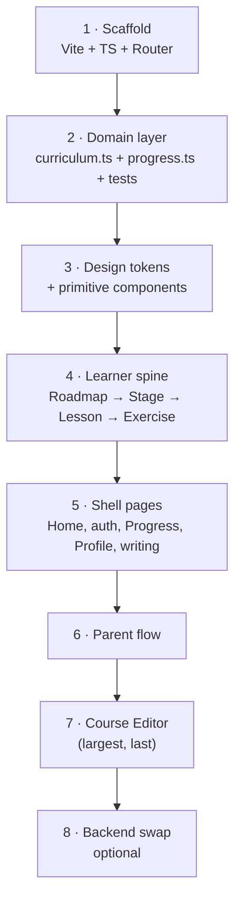

# Englisher — roadmap to React

How to get from 17 standalone `.dc.html` pages to a real React app, without a
big-bang rewrite and without losing the one asset worth keeping (`curriculum.js`).

Read [ARCHITECTURE.md](ARCHITECTURE.md) first — this document assumes its findings.

---

## 0. The premise

The pages are **already React**. `support.js` fetches React 18 from a CDN, parses
`<x-dc>`, and mounts with `createRoot`; `DCLogic` is a React class component and
`renderVals()` is its render step. What you are actually replacing is:

| Prototype thing | React thing | Difficulty |
|---|---|---|
| `<x-dc>` template + `sc-for` / `sc-if` | JSX + `.map()` / `&&` | **Mechanical** |
| `renderVals()` returning a flat value bag | component body returning JSX | **Mechanical** |
| `class Component extends DCLogic` | function component + `useState` | **Mechanical** |
| `href="Lesson.dc.html?stage=2"` | `<Link to="/stage/2/lesson/1">` | Easy |
| `window.loadCurriculum()` global | imported module / API call | Easy |
| 739 inline hex literals | design tokens | Tedious, high value |
| 5 hardcoded copies of the stage list | one data source | **The real work** |

The migration is mostly *transcription*, not redesign. The genuinely new work is the
data layer: killing the duplicate content and the four sets of demo progress
constants. Do that work once, in React, rather than twice.

---

## 1. Target stack

| Concern | Choice | Why |
|---|---|---|
| Build | **Vite** | Already proven in this repo — `uploads/cosmic-planet-course-map/` is a working Vite + React 19 + TS app you can crib the config from. |
| Language | **TypeScript** | The content model has a real schema (§3). Typing it is the payoff. |
| Routing | **React Router** | 17 pages currently linked by filename + query string. |
| Styling | **CSS variables + CSS Modules** (or Tailwind v4 tokens) | The palette exists in Figma variables; the code needs a single place for it. |
| State | **React Context + `useReducer`**, plus TanStack Query when a backend appears | Two independent slices only (curriculum, parent link) — Redux is overkill. |
| Testing | **Vitest** | `parseRich`, `ensureCards`, exercise grading are pure functions begging for tests. |

Target layout:

```
src/
  main.tsx  App.tsx  routes.tsx
  domain/          curriculum.ts  progress.ts  parentLink.ts  richtext.ts  types.ts
  design/          tokens.css  global.css
  components/      Button  TextField  Card  Chip  Tile  ScreenHeader  BottomNav  ProgressBar  Mascot
  features/
    learner/       Home  SignUp  SignIn  PlacementTest  Roadmap  StageLessons  Lesson
                   Exercise  GuidedEssay  SoloEssay  FormalLetter  Progress  Profile
    parent/        ParentAccess  ParentDashboard
    admin/         CourseDashboard  CourseEditor
  lib/             storage.ts
public/assets/     (from assets/)
```

---

## 2. Phase plan

Seven phases. Phases 1–3 are prerequisites; 4–7 are page conversion in dependency
order, so the app is runnable and demoable at the end of every phase.



---

### Phase 1 — Scaffold (½ day)

1. `npm create vite@latest englisher-app -- --template react-ts` **in a new
   `app/` folder inside this repo**, so the prototype keeps working side by side.
2. Copy `assets/` → `app/public/assets/`.
3. Set up `react-router-dom` with the URL map below, all routes rendering a
   placeholder. Deep links from the prototype (`?stage=`, `?lesson=`) become path
   params, and both a slug and a 1-based index must keep resolving — `Lesson.dc.html`
   already accepts either (see its `pick()` helper); preserve that.

| Prototype URL | React route |
|---|---|
| `Duolingo Style Homepage.dc.html` | `/` |
| `Sign Up.dc.html` / `Sign In.dc.html` | `/signup`, `/signin` |
| `Placement Test.dc.html` | `/placement` |
| `Course Roadmap.dc.html` | `/learn` |
| `Stage Lessons.dc.html?stage=2` | `/learn/:stageId` |
| `Lesson.dc.html?stage=2&lesson=1` | `/learn/:stageId/:lessonId` |
| `Exercise.dc.html?stage=2&lesson=1` | `/learn/:stageId/:lessonId/practice` |
| `Guided Essay` / `Solo Essay` / `Formal Letter` | `/write/guided`, `/write/solo`, `/write/letter` |
| `Progress.dc.html` / `Profile.dc.html` | `/progress`, `/profile` |
| `Parent Access.dc.html` | `/parent/access` |
| `Parent Dashboard.dc.html` | `/parent` |
| `Course Dashboard.dc.html` / `Course Editor.dc.html` | `/admin`, `/admin/editor` |

**Exit criterion:** `npm run dev` serves a blank routed shell.

---

### Phase 2 — Domain layer (1–2 days) ← *the highest-value phase*

Port `curriculum.js` and `parent-link.js` to typed ES modules. This is a
copy-paste-plus-types job: neither file touches the runtime.

```ts
// domain/types.ts
export type Bilingual = { en: string; si: string };
export type ExerciseType = 'mcq' | 'gap_fill' | 'drag_order' | 'match' | 'free_text';
export type CardType = 'text' | ExerciseType;
export type Column = 'left' | 'right' | 'full';

export interface Card { id: string; type: CardType; column: Column;
  body?: Bilingual; prompt?: Bilingual; payload?: Payload; feedback?: Feedback }
export interface Lesson { id: string; order: number; kind: 'teach' | 'practice';
  title: Bilingual; cards: Card[]; exercises: Exercise[] }
export interface Stage { id: string; order: number; title: Bilingual;
  theme: { from: string; to: string }; unlock: Unlock; lessons: Lesson[] }
export interface Curriculum { version: number; stages: Stage[] }
```

Make `Payload` a **discriminated union keyed on `type`** — that is what turns
`TYPE_META` from a convention into a compiler-enforced contract, and it is the
single biggest correctness win of moving to TS.

Then, in the same phase:

1. **Write the progress model that doesn't exist yet.** One module, one shape,
   replacing `DEMO_XP` / `DEMO_STREAK` / `CURRENT_STAGE` / `CURRENT_PCT` scattered
   across four pages (which already disagree — 7-day streak on Progress, 5-day on
   the Parent Dashboard).

   ```ts
   // domain/progress.ts
   export interface Progress {
     xp: number; streakDays: number; lastActiveISO: string;
     completedLessonIds: string[];         // slugs, never indices
     stageUnlocks: Record<string, boolean>;
   }
   export function stagePercent(p: Progress, stage: Stage): number
   export function currentStage(p: Progress, c: Curriculum): Stage
   export function isStageUnlocked(p: Progress, stage: Stage, c: Curriculum): boolean
   ```

   Seed it from one demo constant object so screenshots stay consistent, but derive
   every displayed number from `Progress` + `Curriculum`.

2. **Delete the duplicate stage lists.** Roadmap, Progress, Stage Lessons and Parent
   Dashboard each carry their own 8-stage array; `curriculum.js` has 3. Reconcile
   into `CURRICULUM_DEFAULT` (extend it to the full 8 stages) — this is a content
   decision, not a code one, and it must be made before Phase 4.

3. **Vitest suite** over `parseRich`, `ensureCards` (assert idempotence),
   `syncLessonFromCards`, `repairUnlocks`, `cardGridColumn`, `parentContactChannel`,
   and exercise grading extracted from `Exercise.dc.html`.

4. `lib/storage.ts` wrapping the two `localStorage` keys behind
   `getCurriculum/setCurriculum/getParentLink/setParentLink` — one seam to swap for
   `fetch` in Phase 8.

**Exit criterion:** `npm test` green, and every number any screen displays is
derivable from `Curriculum` + `Progress`.

---

### Phase 3 — Design tokens and primitives (1–2 days)

**Tokens.** 739 hardcoded hexes across 17 pages (145 in the Course Editor alone).
Pull them from Figma rather than transcribing by hand — the `Englisher/Color` and
`Englisher/Layout` variable collections are in file `rKyXwnpOEf0k442mEOY8of`
(see [FIGMA.md](FIGMA.md)); `get_variable_defs` on that file emits them directly.

```css
/* design/tokens.css */
:root {
  --c-primary: #6C4FF6;  --c-primary-deep: #5539E0;  --c-primary-tint: #ECE8FB;
  --c-bg: #F7F5FF;       --c-ink: #1E1B2E;           --c-ink-muted: #6B6580;
  --c-line: #D8D3EE;     --c-disabled: #C6BFE4;      --c-disabled-deep: #ADA5CE;
  --font-display: 'Baloo 2', sans-serif;
  --font-body: 'Inter', sans-serif;
  --font-si: 'Noto Sans Sinhala', 'Inter', sans-serif;
  --r-card: 20px; --r-tile: 12px; --r-pill: 999px;
}
```

**Primitives**, each already existing as a Figma component with variants:

| Component | Figma node | Variants |
|---|---|---|
| `Button` | `24:19` | primary/secondary × lg/md, + the `box-shadow: 0 6px 0` press effect |
| `TextField` | `30:22` | |
| `SocialButton` | `65:42` | google / facebook |
| `SettingsRow` | `73:66` | |
| `StatTile` / `CheckRow` | `87:72` / `88:89` | admin |
| `StepRow` / `VisibilityRow` / `ScreenHeader` | `125:145` / `125:152` / `125:153` | parent |

Plus the ones the prototype repeats inline but Figma never named: `Card`, `Chip`,
`Tile`, `CardGrid` (the `col-left/right/full` grid), `ProgressBar`, `BottomNav`, and
a `<Si>` wrapper for Sinhala text (it needs the Noto font on every instance —
currently a hand-applied `class="si"` and easy to forget).

**Exit criterion:** a `/kitchen-sink` route rendering every primitive in every
variant. Zero raw hexes in `components/`.

---

### Phase 4 — The learner spine (3–4 days)

Convert in this order, because each depends on the one before:
**Course Roadmap → Stage Lessons → Lesson → Exercise.**

These four are the demo path and the two most template-heavy learner pages
(`Lesson` 8 loops / 14 conditionals, `Exercise` 9 / 19). Do them while the
translation rules are fresh.

#### The mechanical translation rules

| `.dc.html` | React |
|---|---|
| `{{ expr }}` in text | `{expr}` |
| `attr="{{ x }}"` | `attr={x}` |
| `style="a: {{ x }}"` | `style={{ a: x }}` (camelCase keys) |
| `<sc-for list="{{ xs }}" as="x">…</sc-for>` | `{xs.map(x => <Fragment key={x.id}>…</Fragment>)}` |
| `<sc-if value="{{ c }}">…</sc-if>` | `{c && <>…</>}` |
| `class=` | `className=` |
| `<helmet><style>` | co-located CSS module |
| `renderVals()` returning a bag | the component body itself |
| `this.state` / `this.setState` | `useState` |
| `new URLSearchParams(location.search)` | `useParams()` / `useSearchParams()` |

**Do not port `renderVals()` verbatim.** Its flat bag of primitives
(`isMcq`, `isGapFill`, `ctaBg`, `ctaShadow`, `cellClass`…) exists only because the
template language cannot branch on a type or nest a component. In React, this:

```js
isMcq: cd.type === 'mcq', isGapFill: cd.type === 'gap_fill', /* …5 flags… */
```

collapses to one `switch (card.type)` returning a component — `<McqCard>`,
`<GapFillCard>`, `<DragOrderCard>`, `<MatchCard>`, `<FreeTextCard>` — and
`ctaBg`/`ctaShadow` become a `disabled` prop on `<Button>`. Expect each page to
shrink 30–50%. `Lesson.dc.html`'s 5 boolean flags + 4 payload shapes is the
canonical example; convert it first and use it as the reference for the rest.

The card renderer built here (`<CardGrid>` + the five card components) is reused by
**Lesson, Exercise and the Course Editor preview** — three consumers, so it is worth
getting right.

**Exit criterion:** roadmap → stage → lesson → exercise → back, driven entirely by
`Curriculum` + `Progress`, with a lesson completion writing real progress.

---

### Phase 5 — Shell pages (2–3 days)

Homepage, Sign Up, Sign In, Placement Test, Progress, Profile, Guided Essay, Solo
Essay, Formal Letter. Mostly static markup with 0–2 loops each; fast once the
primitives from Phase 3 exist.

Two notes:
- **Auth is still fake.** Keep it fake, but put it behind an `AuthContext` with
  `signIn/signUp/signOut/user` so Phase 8 swaps the implementation, not the callers.
- **Placement Test** (8 conditionals) should write its result into `Progress`
  — currently it decides a starting stage and then nothing consumes it.

---

### Phase 6 — Parent flow (1 day)

Parent Access (3 states: `none` / `invited` / `accepted`) and Parent Dashboard.
`parent-link.js` is already a clean module — it ports almost as-is. The dashboard
must read the Phase-2 progress model, which is what finally makes the parent's
streak agree with the learner's.

---

### Phase 7 — Course Editor (4–6 days) ← *do it last*

1,449 lines, 18 loops, 34 conditionals, 145 hex literals — roughly a third of the
whole prototype, and the one page where the current code is genuinely an
application rather than a mock. Leave it until the primitives, the typed schema and
the card renderer all exist; then it is composition rather than invention.

Structure it as:

- `<EditorLayout>` — tree sidebar · card list · live preview (3 panes)
- `<CurriculumProvider>` — `useReducer` over the typed `Curriculum`. The existing
  `edit(mutator)` clone-mutate-re-derive pattern maps exactly onto a reducer; keep
  `normaliseCurriculum` as the post-reducer step so derived legacy fields stay in
  sync.
- `<CardEditor>` — a `switch` on card type into five per-type editors, mirroring
  the five renderers from Phase 4.
- Preserve the good behaviours: two-click armed deletes, draft/save cycle,
  reorder + `repairUnlocks`, and live preview reusing the *real* `<CardGrid>`.

The reducer is worth unit-testing (add/delete/reorder/retype a card, then assert
`syncLessonFromCards` derived output and `repairUnlocks` invariants).

---

### Phase 8 — Backend swap (optional, when a server exists)

The prototype already documents its own seams; honour them:

| Endpoint | Replaces |
|---|---|
| `GET /api/curriculum` | `loadCurriculum()` |
| `PUT /api/admin/curriculum` | `saveCurriculum()` |
| `GET /api/admin/analytics` | (new — deliberately *not* part of the content object) |
| `GET/PUT /api/progress` | `domain/progress.ts` persistence |
| `POST /api/parent-links` | `parent-link.js` (a `parent_links` row) |
| `POST /api/auth/*` | `AuthContext` |

Because Phase 2 put everything behind `lib/storage.ts`, this is one file plus
TanStack Query wrappers — no page changes.

---

## 3. Effort summary

| Phase | Scope | Estimate |
|---|---|---|
| 1 · Scaffold | Vite, TS, Router, assets | 0.5 d |
| 2 · Domain | types, progress model, dedupe content, tests | 1–2 d |
| 3 · Design system | tokens + ~13 primitives | 1–2 d |
| 4 · Learner spine | Roadmap, Stage Lessons, Lesson, Exercise | 3–4 d |
| 5 · Shell pages | 9 pages | 2–3 d |
| 6 · Parent | 2 pages | 1 d |
| 7 · Course Editor | 1 page, 1,449 lines | 4–6 d |
| **Total** | | **~13–19 days** |

Phase 7 is a third of the budget for one page. If time is short, ship Phases 1–6
and keep the prototype editor running against the same `localStorage` key — the
storage format is identical, so both can coexist.

---

## 4. Sequencing rules

1. **Never convert a page before its data source exists.** Phase 2 before Phase 4,
   always. Converting a page that still hardcodes 8 stages just moves the
   duplication into React.
2. **Keep the prototype runnable throughout.** Build in `app/`; delete `*.dc.html`
   only when its React route is live. The prototype is the reference implementation
   and the fallback demo.
3. **Convert whole flows, not whole file types.** A half-converted roadmap is not
   demoable; a fully converted learner spine is.
4. **Port logic, rewrite markup.** `curriculum.js`, `parent-link.js`, `parseRich`
   and the grading rules move over intact. The `<x-dc>` markup and every
   `renderVals()` view-model flag are throwaway — do not preserve their shape.
5. **`support.js` is deleted, never ported.** It is generated code implementing a
   template language that React replaces entirely.

---

## 5. What to do first, this week

Even if the rewrite slips, these three are worth doing and make it cheaper:

1. **Extend `CURRICULUM_DEFAULT` to the real 8 stages** and point Roadmap, Progress,
   Stage Lessons and Parent Dashboard at it. Kills 4 duplicate arrays.
2. **Write `progress.js`** with the shape from Phase 2 and replace the four sets of
   demo constants. Fixes the 7-vs-5-day streak contradiction.
3. **Export the Figma variables to `tokens.css`** and start replacing hexes,
   beginning with the primary purple ramp (`#6C4FF6` / `#5539E0` / `#ECE8FB`).

All three are Phase 2/3 work done early — nothing is thrown away when the React
scaffold lands.
