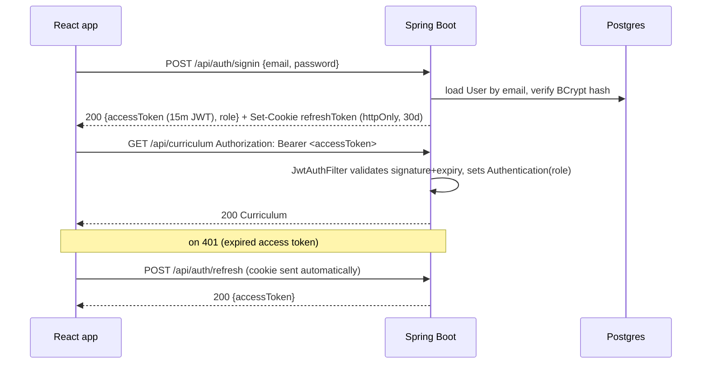
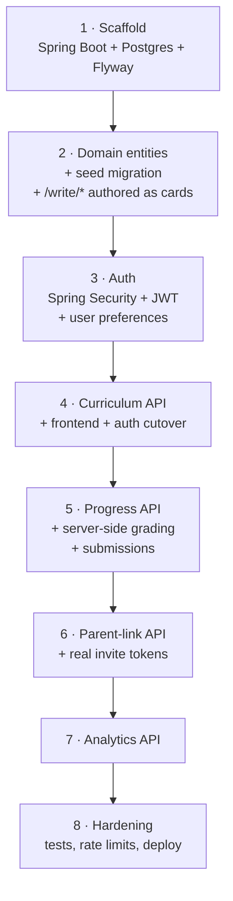

# Englisher — roadmap to a Spring Boot backend

How to get from the current client-only React app (`app/`, all state in
`localStorage`) to a real Spring Boot API, without breaking the frontend
mid-migration and without redesigning the domain model — it's already right.

Read [REACT-MIGRATION.md](REACT-MIGRATION.md) first — this document assumes the
React app it describes is built (it is, under `app/`) and picks up exactly
where that one left off, at its own "Phase 8 — Backend swap."

> **Status: the server described here now exists, under [`server/`](server/).**
> Phases 1–3 and the server halves of 4–7 are built and tested — every endpoint
> in §3, against PostgreSQL, with `repairUnlocks` and `gradeCard` ported and the
> frontend's own Vitest cases carried over as JUnit. What is *not* done is the
> frontend cutover: `app/` is untouched and still on `localStorage`, so the
> "**Frontend**" step in each of Phases 4–6, and all of Phase 8, remain open.
> See [server/README.md](server/README.md) for how to run it and for the
> deliberate gaps (invitations are logged rather than emailed; two analytics
> figures have no source yet).

---

## 0. The premise

The frontend was built with this migration in mind, not as an afterthought:

| Already in place | What it gives the backend |
|---|---|
| `app/src/domain/types.ts` | The API contract. `Curriculum`, `Stage`, `Lesson`, `Exercise`, `Card`, the eight `*Payload` unions, `Progress`, `ParentLink` — these TypeScript interfaces **are** the DTO shapes to serialize. |
| `app/src/lib/storage.ts` | The one seam. `getCurriculum/setCurriculum`, `getProgress/setProgress`, `getParentLink/setParentLink` are called from every page instead of touching storage directly. It is a pure re-export barrel over `domain/curriculum.ts`, `domain/progress.ts` and `domain/parentLink.ts` — so the `fetch` rewrite lands in those three `load*`/`save*` pairs, and no page import changes at all. |
| `app/src/hooks/useAuth.tsx` | The auth seam. `signIn/signUp/signOut` and the `Role` type (`student \| parent \| admin`) are already the exact shape a real login needs to fill. |
| `app/src/components/RequireRole.tsx` | Client-side route gating already exists. The backend's job is to make the same three roles authoritative, not to invent a new model. |
| `curriculum.js`'s own header comment (ported into `domain/curriculum.ts`) | Documents its own seams: `GET /api/curriculum`, `PUT /api/admin/curriculum`, `GET /api/admin/analytics` (deliberately separate from content — "content is edited, analytics are observed"), and `parent-link.js` notes its state is "really a row in a `parent_links` table." |

**Nothing about the data model changes.** The work is: stand up endpoints
that serve exactly what `domain/types.ts` already describes, put real auth
and authorization behind them, and repoint `lib/storage.ts` +
`useAuth.tsx` at them.

### Screens that landed after this plan was first drafted

Four things have shipped frontend-side since. Three of them fit the plan
unchanged; two of them need backend storage this document originally had
no home for, and both are called out again where the work actually falls
(§2, §3, §5).

| Shipped | Backend consequence |
|---|---|
| **Onboarding flow** — `/onboarding/goal → language → streak → walkthrough`, four pages | Collects three real answers (learning goal, language mode `en\|si\|both`, streak-goal days) and **persists none of them** — every one is a `useState` that dies on navigate. Needs a user-preferences store; see §2. |
| **Writing tasks** — `/write/guided`, `/write/solo`, `/write/letter` over a shared `WritingTask.tsx` | The learner's text and rubric ticks are `useState`, and "Submit" is a `<Link>` back to the stage — **nothing is saved anywhere**. Needs a submissions table; see §2 and §3's third design call. |
| **Placement test** — `/placement` | Already writes through the right seam (`setCurrentStage` → `useProgress`), so §3's `POST /api/progress/placement` covers it. Two catches: its *questions* are hardcoded in the component (§7 rule 6), and its "try a lesson first" button mints a fake `guest@example.com` account (Phase 3, step 5). |
| **Profile** — `/profile` | Reads `useAuth` and `useParentLink`; no new persistence except the language toggle, which is the same preferences gap as onboarding. |

### The four keys this migration retires

Every piece of persisted state in the app, and where it goes:

| `localStorage` key | Written by | Replaced by | Phase |
|---|---|---|---|
| `englisher.curriculum.draft` | `domain/curriculum.ts` | `GET /api/curriculum`, `PUT /api/admin/curriculum` | 4 |
| `englisher.progress` | `domain/progress.ts` | `GET /api/progress` + the completion/placement endpoints | 5 |
| `englisher.parentLink` | `domain/parentLink.ts` | `/api/parent-links/*` | 6 |
| `englisher.auth` | `hooks/useAuth.tsx` | in-memory access token + httpOnly refresh cookie (§4) | 3 (API) / 4 (client) |

When no module writes any of those four keys, the migration is done — that
is the whole checklist. Nothing else in `app/src` touches `localStorage`;
grep confirms the only call sites are the three `domain/*.ts` load/save
pairs and `useAuth.tsx`.

---

## 1. Target stack

| Concern | Choice | Why |
|---|---|---|
| Runtime | **Java 21, Spring Boot 3.3+** | LTS, virtual threads available if needed later, current Spring Security's OAuth2/JWT support is mature. |
| Web | **Spring Web (MVC)**, not WebFlux | The workload is CRUD over a small relational model — no reason to take on reactive complexity. |
| Persistence | **Spring Data JPA + Hibernate**, **PostgreSQL** | JSONB support for the polymorphic card payload (§3); H2 in-memory for tests. |
| Migrations | **Flyway** | Versioned SQL, and the seed curriculum ships as migration `V2__seed_curriculum.sql` — the same content as `CURRICULUM_DEFAULT`, so the deployed default matches the prototype's. |
| Security | **Spring Security 6 + JWT** (access + refresh) | Stateless access tokens sized for the three-role model; see §4. |
| Validation | **Bean Validation (Jakarta)** | `@NotBlank`, `@Size`, plus one custom validator for "payload matches card type." |
| API docs | **springdoc-openapi** | Free `/swagger-ui.html`, useful the moment there's more than one consumer. |
| Build | **Maven** | Matches most Spring Boot tutorials/tooling the team will reach for; Gradle is an equally fine substitute if preferred. |
| Testing | **JUnit 5 + Mockito** (unit), **Testcontainers** (repository/integration, real Postgres) | Matches the frontend's own testing posture (Vitest over the domain layer) — test the layer with the business rules, not the framework wiring. |

Suggested module layout (single Maven module is fine at this size — package by feature, not by layer):

```
server/
  src/main/java/lk/englisher/
    auth/         User, Role, AuthController, JwtService, SecurityConfig
    curriculum/   Stage, Lesson, Exercise, Card entities; CurriculumController; CurriculumService
    progress/     Progress entity; ProgressController; ProgressService
    parent/       ParentLink entity; ParentLinkController; ParentLinkService
    analytics/    AnalyticsController (read-only, aggregates progress — never touches content)
    common/       ApiError, GlobalExceptionHandler, AuditFields (createdAt/updatedAt base class)
  src/main/resources/
    db/migration/ V1__init.sql, V2__seed_curriculum.sql, ...
    application.yml, application-dev.yml, application-prod.yml
  src/test/java/lk/englisher/...
```

---

## 2. Data model

Maps directly onto `domain/types.ts` — same names, same nesting, because that
file is the contract.

```mermaid
erDiagram
  USER ||--o| PARENT_LINK : "invites (as child)"
  USER ||--o| PARENT_LINK : "accepts (as parent)"
  USER ||--|| PROGRESS : has
  USER ||--o{ SUBMISSION : writes
  CARD ||--o{ SUBMISSION : "answers (essay/rubric only)"
  STAGE ||--o{ LESSON : contains
  LESSON ||--o{ EXERCISE : contains
  LESSON ||--o{ CARD : "cards (holder_type=lesson)"
  EXERCISE ||--o{ CARD : "cards (holder_type=exercise)"

  USER { uuid id  string email UK  string password_hash  string name  enum role  jsonb preferences  timestamp created_at }
  STAGE { uuid id  string slug UK  int order  jsonb title  jsonb theme  jsonb unlock  bool placeholder }
  LESSON { uuid id  uuid stage_id FK  string slug  int order  enum kind  jsonb title }
  EXERCISE { uuid id  uuid lesson_id FK  enum type  int order }
  CARD { uuid id  uuid holder_id  enum holder_type  enum card_type  enum column  bool border  jsonb body_or_prompt  jsonb payload  jsonb feedback  int order }
  PROGRESS { uuid id  uuid user_id FK UK  int xp  int streak_days  timestamp last_active  jsonb completed_lesson_ids  uuid current_stage_id  int current_stage_pct }
  PARENT_LINK { uuid id  uuid child_user_id FK  uuid parent_user_id FK "nullable until accepted"  string contact  enum channel  enum status  string invite_token UK  timestamp invited_at  timestamp accepted_at  timestamp expires_at }
  SUBMISSION { uuid id  uuid user_id FK  uuid card_id FK  text body  jsonb rubric_ticks  enum status  timestamp submitted_at  timestamp updated_at }
```

Notes on the deliberate departures from a naive 1:1 table-per-TS-interface mapping:

- **`Card.payload` stays JSON (JSONB), not eight payload tables.** The
  frontend already models this as a discriminated union
  (`McqPayload | GapFillPayload | DragOrderPayload | MatchPayload |
  FreeTextPayload | MultiSelectPayload | EssayPayload | RubricPayload`)
  keyed on `card_type` — mirroring that with a JSONB
  column plus a Jackson polymorphic deserializer (keyed the same way) is
  less code than eight tables and an equal number of join fetches, and it's
  exactly as type-safe at the DTO boundary. Only add a real table for a
  payload shape if it needs to be queried or joined on directly — none do
  yet. The payoff is already visible: the three newest card types
  (`multi_select`, `essay`, `rubric`) were added frontend-side as pure
  additions to this union, and cost a JSONB schema exactly nothing.
- **`ParentLink` needs a real account model the prototype didn't have.**
  `parent-link.js` only ever stored a `contact` string — there was no
  concept of the parent as an account, because the whole app was one
  session. Now that `parent`/`student`/`admin` are real accounts (see
  `useAuth.tsx`), the invite must resolve to an actual `User` row on
  acceptance: `child_user_id` is set immediately, `parent_user_id` stays
  null until someone holding a valid, unexpired `invite_token` accepts it
  — which is also the point where a parent who doesn't have an account yet
  gets prompted to create one. This is genuinely new backend logic, not a
  straight port.
- **`User.preferences` is JSONB for the same reason `Card.payload` is.**
  The onboarding flow asks three questions — learning goal, language mode
  (`en | si | both`), streak-goal days — and today throws all three away
  the moment the page unmounts. They belong on the account, but they are
  read as a blob, never queried or joined on, and the set will grow as
  onboarding does. One `preferences` JSONB column beats three nullable
  columns and a migration per question. `Profile.tsx`'s language toggle
  (its own `useState<'en' | 'si'>`, defaulting to `en` on every visit)
  reads from the same place once it exists — as does every other page
  that currently keeps a private copy of that toggle.
- **`Submission` is new — the writing tasks currently persist nothing.**
  `/write/guided`, `/write/solo` and `/write/letter` render a prompt, a
  `<textarea>`, an optional self-assessment rubric, and a "Submit" button
  that is a `<Link>` back to the stage. The learner's paragraph is never
  stored, never seen by a parent, and never counted toward XP. A row per
  learner-per-card (`body`, `rubric_ticks`, `status`) is the smallest
  thing that fixes it, and it is the same shape whether the prompt comes
  from a hardcoded page or, later, from an `essay`/`rubric` card — which
  is exactly why those two card types were added to `types.ts` (§3's
  third design call).

Content-model invariants to carry over from `curriculum.js` / `domain/curriculum.ts`,
enforced server-side wherever the editor currently enforces them client-side only:

- Stage/lesson/exercise/card ids are **stable slugs, never reused**, even
  after reordering or deleting siblings — `repairUnlocks` and `ensureCards`'s
  idempotence (already unit-tested on the frontend) both depend on this.
- `unlock.kind === 'afterStage'` must point at a stage that comes earlier in
  `order` — `repairUnlocks` is the existing algorithm; port it into
  `CurriculumService` rather than re-deriving it, and keep its Vitest tests
  as the spec.
- A lesson/exercise's legacy fields (`explanation`, and an exercise's own
  `type`/`prompt`/`payload`/`feedback`) are **derived from its cards**, never
  authored directly — `syncLessonFromCards` is the existing algorithm.

---

## 3. API surface

Grouped exactly like the frontend's own seams (`lib/storage.ts`'s three
exports, plus auth and analytics).

| Method & path | Role | Mirrors |
|---|---|---|
| `POST /api/auth/signup` | public | `useAuth().signUp(name, email, role)` |
| `POST /api/auth/signin` | public | `useAuth().signIn(email, role)` — role is no longer client-chosen; it's whatever the account was created with |
| `POST /api/auth/refresh` | any (refresh token) | new — issues a fresh access token |
| `POST /api/auth/signout` | authenticated | `useAuth().signOut()` — revokes the refresh token |
| `GET /api/curriculum` | student, parent, admin | `getCurriculum()` — read-only for non-admins |
| `PUT /api/admin/curriculum` | admin | `setCurriculum()` — whole-document replace, matches the editor's current draft/Save-draft semantics exactly (see §6) |
| `GET /api/admin/analytics` | admin | `ANALYTICS` in `domain/curriculum.ts` — currently hardcoded demo figures; becomes a real aggregate over `PROGRESS` |
| `GET /api/progress` | student (own), parent (linked child's) | `getProgress()` |
| `POST /api/progress/lessons/{lessonId}/complete` | student | `markLessonComplete()` — becomes a server call so XP can't be forged client-side |
| `POST /api/progress/placement` | student | `setCurrentStage()` — placement test result |
| `GET /api/placement` | public | `PlacementTest.tsx`'s hardcoded `QUESTIONS` — served, not baked in (§7 rule 6) |
| `GET /api/me/preferences` | authenticated | new — onboarding's three answers, currently discarded |
| `PUT /api/me/preferences` | authenticated | new — Profile's language toggle, onboarding's Continue buttons |
| `PUT /api/submissions/{cardId}` | student | new — autosave/submit a writing task's text + rubric ticks |
| `GET /api/submissions` | student (own), parent (linked child's) | new — "what has my child written" on the parent dashboard |
| `POST /api/parent-links/invite` | student | `ParentAccess`'s `onInvite` |
| `POST /api/parent-links/resend` | student | `onResend` |
| `DELETE /api/parent-links` | student | `onCancel` / `onRevoke` |
| `POST /api/parent-links/accept?token=…` | parent (or unauthenticated → prompts signup) | replaces the prototype's "Simulate the parent accepting" button — now a real emailed link |
| `GET /api/parent/dashboard` | parent | `ParentDashboard` — resolves the accepted link, then returns the child's progress + curriculum-derived stage names in one call |

Three design calls worth stating explicitly:

1. **`PUT /api/admin/curriculum` stays whole-document for now, not
   per-node REST resources** (`POST /api/admin/stages`,
   `PATCH /api/admin/lessons/{id}`, …). The Course Editor already has its
   own dirty-tracking/"Save draft" UX built around
   `courseEditorState.ts`'s draft-until-saved pattern — matching that on
   the wire means the *entire* rewrite is "point `setCurriculum` at
   `PUT`," zero editor changes. Move to granular endpoints later (§8) only
   if concurrent admins editing the same draft becomes a real problem —
   it isn't yet, there's one admin role and one draft.
2. **Grading moves server-side.** `domain/grading.ts`'s `gradeCard` is
   pure and already unit-tested — port it as-is into
   `ExerciseGradingService`. Today an answer is graded entirely in the
   browser, which means XP is whatever the client claims it is. Once
   `POST /api/progress/lessons/{id}/complete` exists, the frontend sends
   the exercise's answers, the server grades them with the ported logic,
   and only a passing grade updates `Progress`. This is the one place the
   backend does more than "persist what the frontend already computed."

   **Two of the eight card types are deliberately ungradeable**, and the
   server must not pretend otherwise: `essay` (a long-form written
   response) and `rubric` (a self-evaluation checklist) both always
   return `true` from `gradeCard`. That is correct — nobody can
   auto-grade an essay — but it means XP on an essay exercise is gated
   only on *having answered*, not on quality, and a determined learner
   can submit junk. Accept that rather than fake a check: the honest
   server-side rule is "essay requires non-empty text, rubric requires
   nothing," exactly mirroring `isAnswered`. If essays ever need real
   assessment it belongs in a teacher-review queue, not in `gradeCard`.

3. **The `/write/*` pages are content that escaped the curriculum — the
   backend should not enshrine that.** All three are hardcoded React
   components: `GuidedEssay.tsx` carries its own prompt, idea bank and
   outline as module constants, `FormalLetter.tsx` its own rubric. That
   is the *exact* shape of the "five disagreeing stage lists" problem
   `REACT-MIGRATION.md` already solved once — content living in a page
   instead of in `CURRICULUM_DEFAULT`, drifting the moment anyone edits
   one and not the others. It is also why the `essay` and `rubric` card
   types exist: an `EssayPayload` is `{ ideaBank, outline, minWords }`
   and a `RubricPayload` is `{ sections }` — precisely what these three
   pages hardcode.

   So: **do not build endpoints for the writing tasks.** Author those
   three tasks as `essay`/`rubric` cards on stages 6–8 in the seed
   curriculum (§5, Phase 2), point the pages at `useCurriculum()`, and
   they are served by `GET /api/curriculum` like everything else. The
   only genuinely new endpoint is `PUT /api/submissions/{cardId}` for
   what the learner writes back. Shipping bespoke `/api/write/guided`
   endpoints instead would make the drift permanent and load-bearing.

---

## 4. Security design



- **Access token**: short-lived JWT (15 min), role embedded as a claim,
  sent as `Authorization: Bearer`. Matches `AuthUser.role` in
  `useAuth.tsx` one-to-one.
- **Refresh token**: longer-lived (30 days), **httpOnly cookie**, not
  `localStorage` — the prototype's fake auth used `localStorage` because
  there was nothing to steal; a real refresh token is exactly the kind of
  credential XSS goes looking for. This is the one place the frontend's
  `useAuth.tsx` needs real rework, not just a storage swap: it moves from
  `window.localStorage.setItem('englisher.auth', …)` to relying on the
  cookie + an in-memory access token.
- **Authorization**: `@PreAuthorize("hasRole('ADMIN')")` on
  `CurriculumController`'s write endpoint,
  `hasRole('PARENT')` on the dashboard endpoint, `hasRole('STUDENT')` on
  progress/parent-link endpoints — the same three-way split
  `RequireRole.tsx` already does client-side. Client-side gating stays
  (good UX — instant redirect, no round-trip), but it stops being the
  security boundary; the annotations are.
- **CORS**: the Vite dev server (`localhost:5173`) and the production
  frontend origin both need `Access-Control-Allow-Credentials: true` plus
  an explicit origin allow-list (not `*`, since credentials are involved).
- **Passwords**: BCrypt via `PasswordEncoder`, never logged, never
  returned in any DTO — `User` and its `UserResponse` DTO are different
  classes, deliberately.

---

## 5. Phase plan

Eight phases. Each ends with the app fully working — either still against
`localStorage` (phases 1–3, backend built but not yet wired) or against the
real API (phases 4 onward, cut over per-domain-slice).



### Phase 1 — Scaffold (0.5 day)

1. `spring init` (or start.spring.io) with Web, Data JPA, PostgreSQL
   Driver, Validation, Security, Flyway — Maven, Java 21.
2. `docker-compose.yml` with a Postgres service for local dev; `application-dev.yml`
   points at it, `application-test.yml` uses Testcontainers.
3. `V1__init.sql`: empty schema, just Flyway's own bookkeeping table, to
   confirm the migration pipeline runs.

**Exit criterion:** `./mvnw spring-boot:run` boots against local Postgres with no schema yet.

### Phase 2 — Domain entities + seed data (2–3 days)

1. Entities per the ER diagram in §2. `Card` uses single-table inheritance
   by `holder_type` (lesson vs exercise) with a `holder_id` — simpler than
   two nullable FKs.
2. `V2__seed_curriculum.sql` (or a `@Profile("dev")` `CommandLineRunner`
   seeder, whichever the team prefers for repeatability) — the exact 8
   stages from `CURRICULUM_DEFAULT` in `domain/curriculum.ts`: 3 authored
   (`tenses`, `complex-sentences`, `translation`) and 5 with
   `placeholder: true` and no lessons. This is a content decision already
   made on the frontend; don't re-derive it, copy it. (`Stage` no longer
   carries a `taskHref` — the roadmap routes by stage id, so there is no
   such column to seed.)
3. **While seeding, fold the three `/write/*` tasks into the curriculum**
   as `essay` + `rubric` cards on stages 6–8 (`guided-essays`,
   `solo-essays`, `formal-letters`) — the prompts, idea banks, outlines
   and rubric sections currently hardcoded in `GuidedEssay.tsx`,
   `SoloEssay.tsx` and `FormalLetter.tsx` map field-for-field onto
   `EssayPayload` and `RubricPayload` (§3, third design call). Doing it
   here costs one seed row each and turns three placeholder stages into
   authored ones; doing it later means migrating live submissions.
4. Port `repairUnlocks` and `ensureCards`/`syncLessonFromCards` from
   `domain/curriculum.ts` into `CurriculumService` — same algorithms, same
   invariants, now enforced server-side too. Bring their Vitest test
   *cases* over as JUnit tests (same inputs/outputs); the frontend
   versions stay as the client-side fast-path.
5. Repository layer: Spring Data JPA repositories, nothing exotic —
   `StageRepository.findAllByOrderByOrderAsc()` with `@EntityGraph` to
   avoid N+1 across stage → lesson → exercise → card.

**Exit criterion:** integration test (Testcontainers) that loads the seeded
curriculum and asserts it deep-equals the shape `domain/types.ts` expects
once serialized.

### Phase 3 — Auth + user preferences (2–2.5 days)

1. `User` entity + `Role` enum (`STUDENT`, `PARENT`, `ADMIN`) — literally
   the frontend's `Role` type, uppercased per Spring Security convention.
   Include the `preferences` JSONB column (§2) and
   `GET`/`PUT /api/me/preferences`; it is three fields on the entity that
   already has to exist, and skipping it here means a second migration
   later.
2. `AuthController`: signup, signin, refresh, signout, per §4.
3. `SecurityConfig`: stateless session, JWT filter, method security
   enabled (`@EnableMethodSecurity`), CORS config from §4.
4. Seed one admin account in the dev seeder (`admin@englisher.test` /
   env-var password) — there is no path to becoming an admin through the
   UI, same as the prototype had no such path either.
5. **Decide what a guest is.** `PlacementTest.tsx`'s "try a lesson first"
   calls `signUp('Guest', 'guest@example.com', 'student')` — a fake
   account the fake auth was happy to mint. Against a real backend that
   is either a duplicate-email collision on the second visitor or an
   anonymous-account feature nobody scoped. Cheapest honest fix: let the
   placement test run unauthenticated (it needs `GET /api/placement` and
   nothing else), hold its result in memory, and post it via
   `POST /api/progress/placement` immediately after the real signup.
Note this phase stays backend-only, per the rule above — the frontend is
still on `localStorage` when it ends. `useAuth.tsx`'s rework (§4: in-memory
access token, httpOnly refresh cookie) and onboarding's preference wiring
both land in Phase 4, because both need the `apiClient.ts` that phase
introduces.

**Exit criterion:** `curl` signup → signin → hit a `@PreAuthorize`-guarded
placeholder endpoint with the token, get 200; without it, get 401; with
the wrong role, get 403; `PUT` then `GET /api/me/preferences` round-trips
all three onboarding answers.

### Phase 4 — Curriculum API + frontend/auth cutover (3–4 days)

1. `GET /api/curriculum`, `PUT /api/admin/curriculum` per §3.
2. **Frontend**: add `apiClient.ts` (base URL, attaches the bearer token,
   retries once through `/api/auth/refresh` on 401), then rewrite
   `loadCurriculum`/`saveCurriculum` in `domain/curriculum.ts` to `fetch`
   through it instead of `localStorage`. Every caller of
   `getCurriculum`/`setCurriculum` — `useCurriculum.ts`,
   `courseEditorState.ts` — is unaffected, because they only ever went
   through the `lib/storage.ts` seam.
3. **Frontend, auth**: `useAuth.tsx` moves off `englisher.auth` to the
   real thing — in-memory access token, httpOnly refresh cookie, role
   read from the JWT rather than picked in the sign-in form (§4). This is
   the phase's second-biggest change after the editor's async save, and
   it has to happen here: every endpoint from Phase 4 onward is
   `@PreAuthorize`-gated, so nothing else can cut over until the client
   can actually authenticate. Onboarding's Goal / Language / Streak
   selections ride along with signup and thereafter go through
   `PUT /api/me/preferences`; `Profile.tsx`'s language toggle reads the
   same value instead of resetting to `en` on every visit.
4. Course Editor's `save()` now `await`s a network call instead of writing
   synchronously — add a loading/error state to the "Save draft" button
   (`courseEditorState.ts`'s `save` becomes async; `CourseEditor.tsx`
   shows a spinner and a failure toast). This is the one real UI change
   in this phase beyond the sign-in form losing its role picker.

**Exit criterion:** Course Editor's full flow (add course → add lesson →
add card of each type → Save draft → reload the page → content persists)
works against the live API with the browser's Network tab open, zero
`localStorage.getItem('englisher.curriculum.draft')` calls left.

### Phase 5 — Progress API + server-side grading + submissions (3–3.5 days)

1. Port `domain/grading.ts` (`gradeCard`, `norm`, `isAnswered`) into
   `ExerciseGradingService` — same pure functions, same test cases as
   JUnit tests.
2. `POST /api/progress/lessons/{lessonId}/complete` accepts the learner's
   answers per interactive card, grades them server-side, and only then
   updates XP/streak/`completedLessonIds`.
3. `POST /api/progress/placement` — same shape as `setCurrentStage` in
   `domain/progress.ts` — plus `GET /api/placement` to serve the question
   set that `PlacementTest.tsx` currently hardcodes (§7 rule 6).
4. `PUT /api/submissions/{cardId}` + `GET /api/submissions` — the writing
   tasks' text and rubric ticks, graded by the honest rule from §3's
   second design call (essay: non-empty; rubric: nothing). With the
   tasks now authored as cards (Phase 2), `WritingTask.tsx` reads its
   prompt from `useCurriculum()` and its Submit button becomes a real
   `PUT` instead of a `<Link>`.
5. **Frontend**: `Exercise.tsx`'s `check()` sends answers to the server
   instead of grading locally; `useProgress.ts`'s `update()` becomes a
   thin wrapper over `GET`/the completion endpoint rather than a direct
   `localStorage` writer.

**Exit criterion:** finishing an exercise while the network tab is open
shows the grading round-trip; disabling JS-side "always pass" tampering
(e.g. editing `gradeCard` in devtools) no longer awards XP, because the
server re-grades independently.

### Phase 6 — Parent-link API (1.5–2 days)

1. `ParentLink` entity + the invite-token flow from §2's notes.
2. Email/SMS delivery is **out of scope for this phase** — log the
   invite link to the console/dev mailbox (e.g. Mailhog in
   `docker-compose.yml`), same spirit as the prototype's "PROTOTYPE
   ONLY — the real invitation is a signed link" banner, just one layer
   more real.
3. `GET /api/parent/dashboard` resolves `parent_user_id` → `child_user_id`
   → that child's `Progress` (and, now that they exist, the child's
   recent `Submission` rows — a parent seeing what their child actually
   wrote is the single most useful thing that table unlocks), in one
   call — the frontend's
   `ParentDashboard.tsx` currently does this resolution itself from two
   separate pieces of local state; the endpoint collapses it.
4. **Frontend**: `useParentLink.ts` and `ParentAccess.tsx`/`ParentDashboard.tsx`
   swap their storage calls for the new endpoints. The "Simulate the
   parent accepting" button in `ParentAccess.tsx` can stay in a
   `dev`-only build flag rather than being deleted outright, since manual
   QA still benefits from it until real email delivery exists.

**Exit criterion:** inviting a parent, opening the logged invite link as a
second (parent-role) account, and seeing the dashboard unlock — across
two separate browser sessions, which the prototype could never actually
test since it was one shared `localStorage`.

### Phase 7 — Analytics API (0.5–1 day)

`GET /api/admin/analytics` aggregates real `Progress` rows instead of
returning the hardcoded `ANALYTICS` object — `activeLearners`,
`weeklyActive` (distinct users with `last_active` in the last 7 days),
`byStage` completion/accuracy per stage. Keep the response shape
identical to `domain/curriculum.ts`'s `ANALYTICS` type so
`CourseDashboard.tsx` needs no changes at all.

### Phase 8 — Hardening (2–3 days)

- Rate limiting on `/api/auth/*` (brute-force signin attempts).
- `GlobalExceptionHandler` → consistent `ApiError` JSON, no stack traces
  leaking in prod responses.
- Structured logging + a health endpoint (`/actuator/health`) for
  whatever deploys this (see below).
- Full JUnit + Testcontainers suite in CI; a smoke test that boots the
  full stack (Postgres + API + a headless build of `app/`) and runs the
  same kind of Puppeteer check used during the React migration.
- **Deployment**: Dockerfile for the API (multi-stage Maven build →
  slim JRE image), `docker-compose.yml` wiring API + Postgres + the
  built React static files behind one reverse proxy (nginx or Spring
  serving the Vite build directly) — the specific target (a VPS, a
  managed platform) is a call for whoever owns hosting, not a
  prerequisite for the API being correct.

---

## 6. Effort summary

| Phase | Scope | Estimate |
|---|---|---|
| 1 · Scaffold | Spring Boot, Postgres, Flyway wired up | 0.5 d |
| 2 · Domain + seed | Entities, repositories, ported invariants, `/write/*` authored as cards | 2–3 d |
| 3 · Auth | Signup/signin/refresh, JWT, role security, preferences, guest decision | 2–2.5 d |
| 4 · Curriculum API | Endpoints + frontend cutover, `useAuth` on real tokens | 3–4 d |
| 5 · Progress + grading | Endpoints, server-side grading, submissions, placement, frontend cutover | 3–3.5 d |
| 6 · Parent-link API | Real invite tokens, dashboard resolution | 1.5–2 d |
| 7 · Analytics | Real aggregates | 0.5–1 d |
| 8 · Hardening | Rate limits, tests, deploy | 2–3 d |
| **Total** | | **~14.5–19.5 days** |

Up from the ~11.5–15.5 days this table carried before the onboarding,
writing-task, placement and profile screens landed. The added work is
almost entirely Phases 2–5: authoring three writing tasks as curriculum
cards, a `preferences` column and its two endpoints, the `Submission`
table with its save/read pair, and the `useAuth.tsx` cutover — which was
always implied by §4 but had never been given a phase.

Phases 4–7 each end with a working, fully-cut-over slice — the app is never
half-migrated in a way that breaks it. If time is short, phases 1–4 alone
(real accounts, and curriculum served from a real API; progress and the
parent link still on `localStorage`) already remove the biggest
single-source-of-truth risk: the admin editor writing content nobody but
that one browser can see.

---

## 7. Sequencing rules

1. **Auth before anything else that needs a role.** Phase 3 before Phase 4
   — an endpoint gated on a role that doesn't exist yet is untestable.
2. **Cut the frontend over domain-by-domain, not all at once.** Each of
   phases 4–7 ends with one of `lib/storage.ts`'s three exports (plus
   auth) fully pointed at the network, the others still on
   `localStorage`. Never leave a domain half-migrated (e.g. `GET` from
   the API but `PUT` still writing local storage) — that's the two-source-of-truth
   bug the whole point of this migration is to remove.
3. **Port algorithms, don't re-derive them.** `repairUnlocks`,
   `ensureCards`/`syncLessonFromCards`, and `gradeCard` are already
   correct and already have test cases (`domain/*.test.ts`). Translate
   them line-for-line into the service layer and carry the test cases
   over as JUnit tests, rather than re-implementing the logic from the
   English description in this document.
4. **The seed curriculum is a content decision already made — copy it,
   don't redesign it.** `CURRICULUM_DEFAULT`'s 8 stages (3 authored, 5
   placeholder) are what `REACT-MIGRATION.md` already resolved the
   original prototype's "five disagreeing stage lists" problem into.
   Reopening that decision here would reintroduce the exact drift this
   whole rewrite got rid of.
5. **Grading moves server-side in Phase 5, not earlier.** Doing it before
   Progress exists means grading against nothing; doing it much later
   means shipping a real-money-shaped feature (XP, streaks) that a user
   can trivially forge from devtools for however long that gap lasts.
6. **Content in a component is a bug, not a shortcut — fix it while
   seeding, not after.** Three places still hold content the curriculum
   should own: the `/write/*` prompts and rubrics, `PlacementTest.tsx`'s
   `QUESTIONS`, and that same file's `STAGE_NAMES`, which has *already*
   drifted — it says "Adjectives & Prepositions" and "Everyday
   Translation" where `CURRICULUM_DEFAULT` says "Adjectives, Adverbs &
   Prepositions" and "Sinhala–English Translation". That is the
   ARCHITECTURE.md Weakness 1 relapse, caught early. Each one is cheap to
   move into the seed curriculum in Phase 2 and expensive to move once
   there are `Submission` rows and live learners pointing at it.
7. **Persist onboarding's answers in Phase 3 or delete the questions.**
   Asking a learner their goal, their language and their streak target
   and then discarding all three is worse than not asking: it is three
   screens of friction that buy nothing. Either the `preferences` column
   lands with the `User` entity, or the flow should be honest and drop to
   a single welcome screen.

---

## 8. Stretch goals (post-Phase 8, only if a real need shows up)

- **Granular curriculum endpoints** (`PATCH /api/admin/lessons/{id}`,
  optimistic concurrency via a `version` column) — only worth it once
  there's more than one admin editing concurrently; today's whole-document
  `PUT` is simpler and matches the editor's existing draft/save UX exactly.
- **Real email/SMS delivery** for parent invites (SES/Twilio) — Phase 6
  deliberately stops at "logged invite link" the same way the prototype
  stopped at "simulate accepting."
- **WebSocket/SSE push** for the parent dashboard (live update when a
  child finishes a lesson) — nothing in the current UX asks for this;
  don't build it speculatively.
